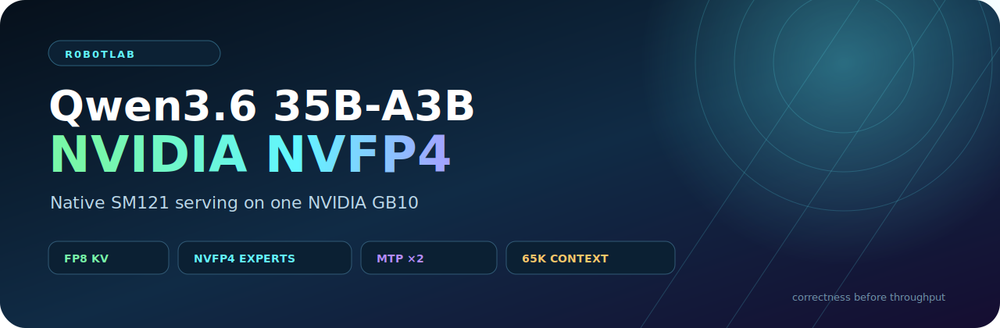

# NVIDIA Qwen3.6 35B-A3B NVFP4 on GB10



[](https://www.nvidia.com/en-us/products/workstations/dgx-spark/)
[](https://github.com/vllm-project/vllm)
[](https://huggingface.co/nvidia/Qwen3.6-35B-A3B-NVFP4)
[](LICENSE)

A correctness-gated, native SM121 vLLM deployment and benchmark release for NVIDIA's published [`nvidia/Qwen3.6-35B-A3B-NVFP4`](https://huggingface.co/nvidia/Qwen3.6-35B-A3B-NVFP4) checkpoint on one NVIDIA GB10.

The checkpoint is mounted read-only. This repository does **not** recalibrate, re-quantize, rewrite, or redistribute model weights.

## Release status

**Complete.** The accepted profile passed native-kernel, scale, semantic, long-generation, GSM8K, concurrency, context-depth, telemetry, energy, artifact-consistency, checksum, and public-safety gates.

```text
Run ID:          nvidia-qwen36-native-20260711T100947Z
Model revision:  491c2f1ea524c639598bf8fa787a93fed5a6fbce
Image digest:    sha256:a072794deee4b7875f4cbc40fb189a674188d7f7a10f32bf45038527c9485cfa
HTML SHA-256:    a97e50a2017c7af8ab0c8d7797d46629e23f2cf08f4c54ae3bf98c6a0dc8d294
Manifest SHA-256:4ad828918634baf239257627c6f1d0226a09d780c1d1dd9774b46713a6210d27
```

The self-contained report is at [`docs/index.html`](docs/index.html). Machine-readable release evidence is under [`benchmarks/runs/nvidia-qwen36-native-20260711T100947Z/`](benchmarks/runs/nvidia-qwen36-native-20260711T100947Z/).

- Repository: https://github.com/r0b0tlab/qwen36-35b-a3b-nvfp4-sm121-vllm
- Published report: https://r0b0tlab.github.io/qwen36-35b-a3b-nvfp4-sm121-vllm/

## Results

### Quality and runtime

| Gate | Result |
|---|---:|
| GSM8K 0-shot, flexible extract | **85.52% ± 0.97%** |
| GSM8K samples | **1,319 / 1,319** |
| Deterministic semantic probes | **9 / 9 passed** |
| Long-generation probes | **3 / 3 passed; all natural `stop`** |
| MTP acceptance | **85.63%** |
| FP8 KV capacity | **5,739,315 tokens** |
| Maximum concurrency at 65,536 tokens/request | **87.58×** |
| Failed concurrency requests | **0** |

GSM8K used `local-chat-completions`, the model chat template, 0-shot greedy decoding, `enable_thinking=false`, and a 2,048-token generation budget. Flexible extraction is the release metric.

### Concurrency scaling

Random 2,048-token inputs, exact 512-token outputs, three repetitions per level. Repetition 1 is warm-up; the table averages repetitions 2 and 3.

| Concurrency | Output tok/s | Mean TTFT | P99 TTFT | Output tokens/J |
|---:|---:|---:|---:|---:|
| 1 | 90.86 | 346.73 ms | 355.13 ms | 3.08 |
| 2 | 134.71 | 495.53 ms | 665.73 ms | 4.39 |
| 4 | 193.22 | 786.30 ms | 1,165.46 ms | 5.95 |
| 8 | 286.31 | 1,348.37 ms | 2,216.93 ms | 8.21 |
| 16 | 373.47 | 2,842.87 ms | 5,026.67 ms | 10.00 |
| 32 | **463.67** | 4,751.62 ms | 8,992.03 ms | **11.36** |

Peak observed GPU utilization was 96%, peak temperature was 84 °C, and c32 required 88.02 J per 1,000 output tokens.

### Context-depth sweep

llama-benchy 0.4.0, 2,048-token prompt, exact 128-token generation, concurrency 1, three measured runs per depth. Coherence passed.

| Existing context | Prefill tok/s | Decode tok/s | TTFR |
|---:|---:|---:|---:|
| 0 | 5,649.7 | 90.7 | 365.1 ms |
| 4,096 | 7,089.1 | 89.7 | 869.0 ms |
| 8,192 | 6,964.9 | 90.7 | 1,472.7 ms |
| 16,384 | 6,233.5 | 85.7 | 2,959.6 ms |

## What runs

| Component | Accepted profile |
|---|---|
| Model | `nvidia/Qwen3.6-35B-A3B-NVFP4` |
| Revision | `491c2f1ea524c639598bf8fa787a93fed5a6fbce` |
| Quantization | `modelopt_mixed` |
| KV cache | FP8 |
| Attention | FlashInfer |
| FP8 linear | `FlashInferFP8ScaledMMLinearKernel` |
| W4A16-labelled ordinary linear targets | Native W4A4 reroute using published `input_scale` tensors |
| NVFP4 linear | `FlashInferCutlassNvFp4LinearKernel` |
| Routed-expert MoE | `FLASHINFER_B12X` |
| Speculative decoding | MTP K=2; Triton draft MoE |
| CUDA graph mode | `PIECEWISE` |
| Maximum model length | 65,536 |
| GPU memory utilization | 0.88 |

No Marlin, weight-only W4A16 execution, emulation, or fallback result is accepted.

## Why the runtime patch exists

The pinned NVIDIA checkpoint labels 161 targets `W4A16_NVFP4`. Forty are aggregate routed-expert targets handled by B12X. The other 121 targets—120 shared-expert projections plus `lm_head`—carry complete calibrated `input_scale` tensors.

In the validated vLLM lineage, the mixed-precision dispatcher otherwise hard-pins those 121 ordinary targets to a weight-only Marlin method. [`patches/patch_modelopt_w4a16_native_w4a4.py`](patches/patch_modelopt_w4a16_native_w4a4.py) narrowly reroutes only eligible calibrated targets through the native ModelOpt W4A4 method. It does not alter checkpoint tensors or metadata.

The independent scale audit found:

```text
Ordinary targets:      121 / 121
Required scale tensors:present
Finite positive scales:121 / 121
Scale range:           0.0041155135 – 0.0654761940
```

See [`docs/NATIVE_W4A4_REROUTE.md`](docs/NATIVE_W4A4_REROUTE.md) for the dispatcher analysis and verification contract.

## KV-cache decision

**FP8 KV is final for this release.** NVFP4 KV was not adopted on SM121 because the separate scale-write and semantic-quality gates remain blocked. Loader or prefill success alone does not qualify it. The NVFP4 weight path and KV-cache dtype are independent decisions.

## Build and run

The model is mounted read-only and is not copied into the image.

```bash
export MODEL_DIR="$HOME/models/llm/nvfp4/nvidia/Qwen3.6-35B-A3B-NVFP4"
export IMAGE=qwen36-35b-a3b-nvfp4-sm121-vllm:native-w4a4-v1

docker build -t "$IMAGE" .
docker run --rm --gpus all "$IMAGE" --audit-only

MODEL_HOST="$MODEL_DIR" IMAGE="$IMAGE" \
  CONTAINER=qwen36-nvfp4-vllm PORT=18080 \
  bash scripts/launch.sh
```

Runtime defaults:

```text
KV_CACHE_DTYPE=fp8
QUANTIZATION=modelopt_mixed
MOE_BACKEND=flashinfer_b12x
LINEAR_BACKEND=flashinfer_cutlass
SPECULATIVE_CONFIG={"method":"mtp","num_speculative_tokens":2,"moe_backend":"triton"}
```

Verify the live endpoint before benchmarking:

```bash
python3 scripts/verify_server.py --base-url http://127.0.0.1:18080
python3 scripts/run_semantic_gate.py --base-url http://127.0.0.1:18080 \
  --output benchmarks/runs/<run-id>/semantic_gate/results.json
```

## Reproduce the campaign

Use a unique run ID and a persistent Herdr workspace:

```bash
RUN_ID="nvidia-qwen36-native-$(date -u +%Y%m%dT%H%M%SZ)"
bash scripts/run_full_campaign.sh "$RUN_ID"
```

The campaign runs GSM8K, c1–c32 serving benchmarks, llama-benchy, two-second telemetry, energy analysis, report generation, artifact verification, SHA-256 manifest generation, and the public-safety scan. It performs no upload.

## Evidence policy

- Curated machine-readable results and hashes are committed.
- Model weights, virtual environments, raw lm-eval samples, telemetry streams, server logs, campaign logs, private addresses, absolute operator paths, and credentials are excluded.
- Rejected Marlin evidence is retained only as a labelled negative control and never feeds release metrics.
- The report concerns NVIDIA's pinned published checkpoint only; no result is copied from another model.

## Credits

- [Qwen](https://github.com/QwenLM) for Qwen3.6.
- [NVIDIA](https://huggingface.co/nvidia) for the published ModelOpt checkpoint.
- [NVIDIA Model Optimizer](https://github.com/NVIDIA/Model-Optimizer).
- [vLLM](https://github.com/vllm-project/vllm) for serving and benchmark infrastructure.
- [FlashInfer](https://github.com/flashinfer-ai/flashinfer) and [NVIDIA CUTLASS](https://github.com/NVIDIA/cutlass) for native kernels.
- [EleutherAI lm-evaluation-harness](https://github.com/EleutherAI/lm-evaluation-harness) and [llama-benchy](https://github.com/XiongjieDai/llama-benchy) for evaluation tooling.

## License

Repository code is MIT licensed. The model and upstream runtime components retain their respective licenses.